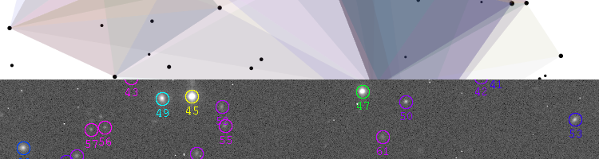

.. alipy documentation master file, created by
   sphinx-quickstart on Sat Sep 29 10:28:19 2012.
   You can adapt this file completely to your liking, but it should at least
   contain the root `toctree` directive.

Welcome to the new alipy !
==========================

About
-----

This is a python package to quickly, automatically, and robustly identify geometrical transforms between optical astronomical images, using only field stars. The images can have different pixel sizes, orientations, pointings and filters.

.. note:: alipy is personal code, and work in progress... The package is already very useful for me, and I hope it will be for you, but don't expect *too* much neither. Any feedback and wishlists are highly welcome !

Summary of what alipy does for you :
 * Run SExtractor (see :doc:`installation`) on the images to get individual source catalogs.
 * Identify corresponding asterisms, roughly following `Lang et al. (2010) <http://adsabs.harvard.edu/abs/2010AJ....139.1782L>`_ aka `astrometry.net <http://www.astrometry.net>`_.
 * Use this identification to match catalogs, align the images (either directly with scipy, or pyraf geomap/gregister), ...

Next stop : a quick look at the :doc:`tutorial`.

Last build of this documentation : |today|.

Contents
--------

.. toctree::
	:maxdepth: 2
	
	installation
	tutorial
	notes
	Autogenerated API <apidoc/alipy.rst>
	

Indices and tables
------------------

* :ref:`genindex`
* :ref:`modindex`
* :ref:`search`

